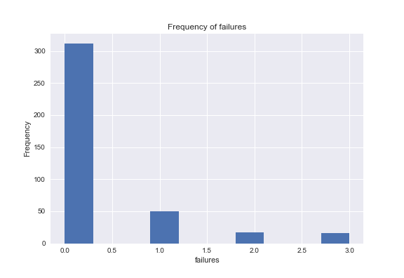
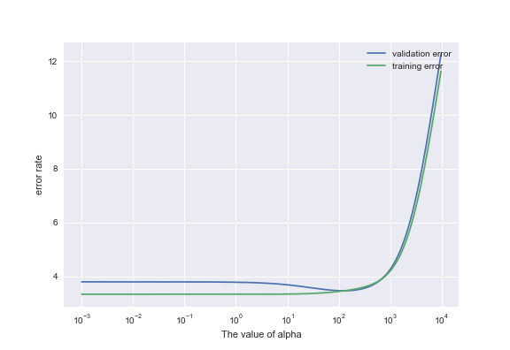

# Mini project-------Analysis of student preference

## Goal
In this project, I am willing to find the best model to predict the student's final grade based on they preference in school. 

## Data

I use part of the [student preference](http://archive.ics.uci.edu/ml/datasets/Student+Performance) data from UCI ML repo.

#### Data Set Information:
This data approach student achievement in secondary education of two Portuguese schools. The data attributes include student grades, demographic, social and school related features) and it was collected by using school reports and questionnaires. Two datasets are provided regarding the performance in two distinct subjects: Mathematics (mat) and Portuguese language (por). In [Cortez and Silva, 2008], the two datasets were modeled under binary/five-level classification and regression tasks. Important note: the target attribute G3 has a strong correlation with attributes G2 and G1. This occurs because G3 is the final year grade (issued at the 3rd period), while G1 and G2 correspond to the 1st and 2nd period grades. It is more difficult to predict G3 without G2 and G1, but such prediction is much more useful (see paper source for more details).


#### Attribute Information:
```
Attributes for both student-mat.csv (Math course) and student-por.csv (Portuguese language course) datasets: 
1. school - student's school (binary: 'GP' - Gabriel Pereira or 'MS' - Mousinho da Silveira) 
2. sex - student's sex (binary: 'F' - female or 'M' - male) 
3. age - student's age (numeric: from 15 to 22) 
4. address - student's home address type (binary: 'U' - urban or 'R' - rural) 
5. famsize - family size (binary: 'LE3' - less or equal to 3 or 'GT3' - greater than 3) 
6. Pstatus - parent's cohabitation status (binary: 'T' - living together or 'A' - apart) 
7. Medu - mother's education (numeric: 0 - none, 1 - primary education (4th grade), 2 – 5th to 9th grade, 3 – secondary education or 4 – higher education) 
8. Fedu - father's education (numeric: 0 - none, 1 - primary education (4th grade), 2 – 5th to 9th grade, 3 – secondary education or 4 – higher education) 
9. Mjob - mother's job (nominal: 'teacher', 'health' care related, civil 'services' (e.g. administrative or police), 'at_home' or 'other') 
10. Fjob - father's job (nominal: 'teacher', 'health' care related, civil 'services' (e.g. administrative or police), 'at_home' or 'other') 
11. reason - reason to choose this school (nominal: close to 'home', school 'reputation', 'course' preference or 'other') 
12. guardian - student's guardian (nominal: 'mother', 'father' or 'other') 
13. traveltime - home to school travel time (numeric: 1 - <15 min., 2 - 15 to 30 min., 3 - 30 min. to 1 hour, or 4 - >1 hour) 
14. studytime - weekly study time (numeric: 1 - <2 hours, 2 - 2 to 5 hours, 3 - 5 to 10 hours, or 4 - >10 hours) 
15. failures - number of past class failures (numeric: n if 1<=n<3, else 4) 
16. schoolsup - extra educational support (binary: yes or no) 
17. famsup - family educational support (binary: yes or no) 
18. paid - extra paid classes within the course subject (Math or Portuguese) (binary: yes or no) 
19. activities - extra-curricular activities (binary: yes or no) 
20. nursery - attended nursery school (binary: yes or no) 
21. higher - wants to take higher education (binary: yes or no) 
22. internet - Internet access at home (binary: yes or no) 
23. romantic - with a romantic relationship (binary: yes or no) 
24. famrel - quality of family relationships (numeric: from 1 - very bad to 5 - excellent) 
25. freetime - free time after school (numeric: from 1 - very low to 5 - very high) 
26. goout - going out with friends (numeric: from 1 - very low to 5 - very high) 
27. Dalc - workday alcohol consumption (numeric: from 1 - very low to 5 - very high) 
28. Walc - weekend alcohol consumption (numeric: from 1 - very low to 5 - very high) 
29. health - current health status (numeric: from 1 - very bad to 5 - very good) 
30. absences - number of school absences (numeric: from 0 to 93) 

these grades are related with the course subject, Math or Portuguese: 
31. G1 - first period grade (numeric: from 0 to 20) 
31. G2 - second period grade (numeric: from 0 to 20) 
32. G3 - final grade (numeric: from 0 to 20, output target)
```

citation: P. Cortez and A. Silva. Using Data Mining to Predict Secondary School Student Performance. In A. Brito and J. Teixeira Eds., Proceedings of 5th FUture BUsiness TEChnology Conference (FUBUTEC 2008) pp. 5-12, Porto, Portugal, April, 2008, EUROSIS, ISBN 978-9077381-39-7. 

## Analysis

### Data wrangling

- At first, I import csv data file `student-mat.csv`
  
- Check the missing value.
  ```school 0.0
sex
0.0
address
0.0
famsize
0.0
Pstatus
0.0
Mjob
0.0
Fjob
0.0
```
```
reason
0.0
guardian
0.0
schoolsup
0.0
famsup
0.0
paid
0.0
```
```
activities
0.0
nursery
0.0
higher
0.0
internet
0.0
romantic
0.0
```
There are no missing value in dataset.
- In this case, we want use some features to predict students final grade(G3), so i use G3 as response variable.
- `school` feature are same, so I delete this feature.
- Recode all feature as number
  
  
### Data Vis (EDA)

- Describe the data
  
  
- I use heatmap in seaborn package to plot the correlation between features.
  
- Plot histogram for some feature as below.
  
  
  
  
  
  
### Basic feature selection

- Drop features with large correlation
- We can see from heatmap plot,Dalc(workday alcohol consumption) have large correlation with Walc(weekly alcohol consumption).So I delete the Wacl from X.
- G1 and G2 are highly correlated, so i delete G1.
- Mather job, father job, and father education are highly correlated, so I delete Fedu and Mjob.

### Model selection

- I try to compare the model from `linearregression`, `Ridge`,`logregression`,`ElasticNet`,`SVR`.
- Training error and test error as below:

  ```
  linearregression
  Training error:  3.338572721713034
  Validation error:  3.7990290283540413

  ridge
  Training error:  3.3386605459173735
Validation error:  3.7852124560396296

  log regression
Training error:  2.9588607594936707
Validation error:  9.468354430379748

  ElasticNet
Training error:  3.857997453215386
Validation error:  3.6716456578719723
 
  SVR
Training error:  4.744763231812732
Validation error:  6.20641164723413
```

- The ridge classifier get small training error and validation error. The ElasticNet classifier can get the lowest validation error but the training error is large. So i choose Ridge method.
- The initial test error is `3.7852124560396296`.
- I compare the different `alpha` to get the best parameter.

  ```
Min Ridge validation error: 3.467283
alpha that Minimun Ridge validation error: 125.892541
```
  
  
- I will choose the alpha=125.
- The test error after model selection reduce to `3.467283`.

### Feature selection again
- In this part, I use the Forward Feature Selection from lab1 solution in DSCI573. Due to I want to fit linear regression, I recode the model score to model MSE.
- The index of feature that select from Forward feature selection function as below:
 
  ```
  found best subset.
features: [26, 20, 8, 25, 15, 24, 19, 5, 10, 22, 0, 14, 4, 2]
final mean xval error: 3.462169249492538
 ``` 
- The test error after model selection reduce to `3.46216`.

### Split dataset and train again

-Based on the results from forward feature selection function, I get the new feature set.
-Use the `train_test_split` split new train and test set.

## Final Result


- After the analysis, my final feature include `Walc`, `internet`,	`Fjob`,`Dalc`,`famsup`,	`goout`,	`higher`,	`Medu`,	`guardian`,	`famrel`,	`sex`,	`schoolsup`,`Pstatus`, `address`.
- I will use `Ridge(alpha=125)` to fit the data.
- I got the MSE as below:

 ```
The MSE of train set  3.438373249400151
The MSE of test set 3.0444961126548
```

- The initial test MSE is  `3.7852124560396296`. 
- The MSE already by decreased `0.75` based on my feature and model selection analysis.